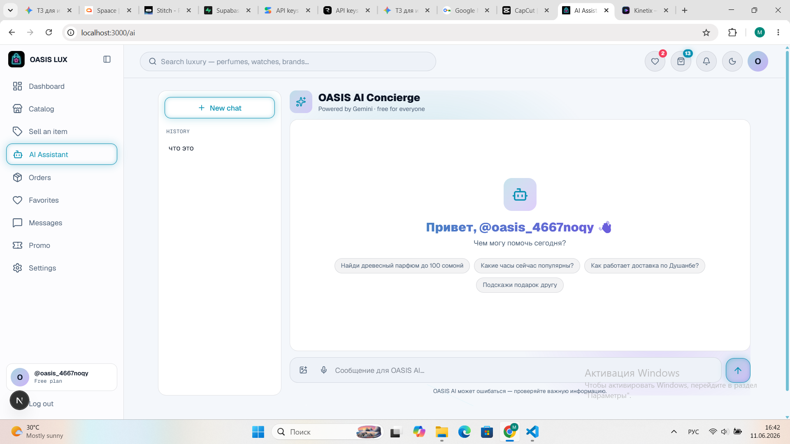
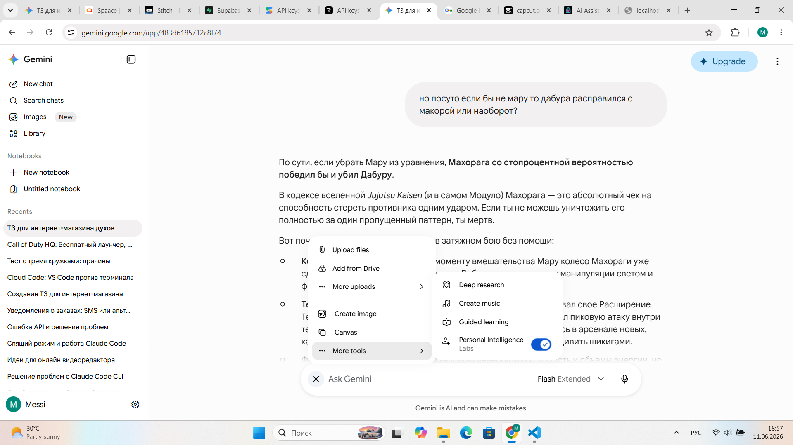
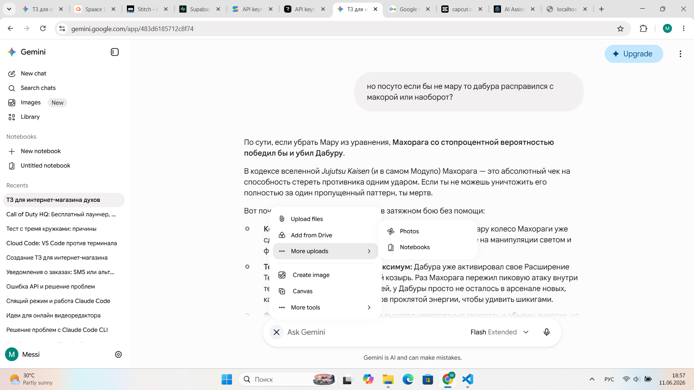

ЗАРАНЕЕ СКАЖУ
ВСЕ ЧТО ТЫ ВИДИШЬ В ПАПКЕ Maket там неправильная иконка проекта
реальная иконка проекта в папке Icon
добовляй именно ее

макет регистра я не сделал потому что все точно также как и в логине просто чучуть тексты и формы другие дизайна

также на страницах home и landing page добавь свайперы
весь сайт должен быть интерактивным и даже бекграунд сзади не простой должен быть

посмотри в папке fishka
там фото моего другого проекта и там на беграунде есть такие штуки толи звезды толи еще чето и они двигаются и притягиваются туда где у меня мышь
у них еще физика есть очень классно и красиво
добавь это тоже
даже левая част в логине и регистре должна быть интерактивной

не добовляй вообще место которые вот чисто дизайн напомню проект огромнейший и для нужен оч огромный бекенд
у тебя кстати доступ вроде есть 

и еще сайт должен переводиться на 3 языка

en ru tj
через настройки тоже
английский русский таджикский
можешь скачивать все необходимые библиотеки которые тебе нужны

еще на странице product by id там снизу должны быть рекомендации других похожих или популярных продуктов
там есть кнопка все и еще свайпер и если нажать на какую небудь другой товар то страница обновится уже с данными о том таваре

у продукта в идеале несколько фоток

когда нажимаешь на кнопку заказать и там вот эти все данные вводишь карточку и прочее и прочее то после этого должна быть страничка с полной инфой как я и говорил
вся карта таджикистана сайт по ip определяет где товар сейчас либо доставщика либо продавца
вся инфа о товаре там
кто заказал кто доставщик
чекы можно скидывать
модерацию на проверку чеков кто курьер кто заказал кто продавец
все это должно быть в той странице
карта таджикистана должна быть 3 д ее можно вертеть там крутить смотреть и показывает где щас твой товар и за сколько километров и все все
еще продавцу моментально должно точно такое же сообщение придти в один из аккаунтов которые он остовлял при регистраии будь то инста или тг

дизайны в папке Maket могут быть разными но твоя задача слить все в идеальную середину
используя кстати иконку в папке Icon

те товары на которые есть скидки с промокодо должны быть сверху соответсвующие штуки типо чтоб показать
и еще
чем больше скидка
тем кайфовее дизайн этой штуки там типо он более радужный с жирным текстом приятный такой 90% скидка типо вау

вот это я просто напишу сюда промпт для тебя чтоб не потерять:
Карочи сайт для распива духов и часы очки барои сайт регистрация даркор нест просто номер мона шид ба чо барои промокод ба каталогам боша

Это промпт от моего друга на таджикском короче

сделай мне полный тз проекта интернет магазин 

его основные функции это 

если клиент покупает заказывает то тебе или тому кто продает должно моментально придти сообщение в на номера телефона(Сначало ответь на вопрос берет ли это деньги с меня или нет, если берет вместо номеров сделаем на телеграм или ватсап или инсту)

каталог должен быть
стиль должен быть максиально имбовым да так что даже на заднем фоне должно быть что то интерактивное
кстати сделай так чтоб когда я двигаю мышкой по вебсайту то там были свои анимации типо эффекты

сайт должен быть по дизайну максимально современным с имбовейшими анимациями и 3d картой

типо по айпи должно  отслеживать только в таджикистане

только карта таджикистана должна быть

продавцу можно отзывы и все прочее оставлять можно того или иного продукта цвета выбирать можно смотреть

должен быть искуственный интилект мини в виде мини чата

когда смс приходит в аккаунт инсты тикток тг или ватсапа то та вся инфа о продукте

сколько осталось ехать сколько километров количество

стоимость

общая стоимость

стоимость заказа

номера телефона доставщика 

имя доставщика

невероятна проработанныые страницы до мелочей каждая логика

на регистрации запрашивать никнеймы тг, тикток, ватсап или инста

хотябы 1 должно быть

и сделай дизайн так чтоб справа вот форма а слева там же есть обычно декорации но там будут такие вот анимированные кнопки

типо там иконка тг но она визуалом намекает на фоне что там это кнопка

и выскакивает модалка маленькая с инпутом никнейма

можешь создать сам на супебейс новый проект сам

бекенд должен быть очень масштабным

дарк мод лайт мод

страница настроек

все динамчино и красиво

3д и анимации как в 

https://vision.spaace.io/

все 20 страниц

landing page максимально подробный и длинный

login & register

home, profile, notifications, checkout page product by id page

products

catalog products with 100+ filters

ai page, animated sending messages like in gemini and chat gpt, u can send him photos

cart page, favorites page

chat с владельцем by id page messages page

if i ask about my profile

ai will send me to the that page i told

or for example i say : is there anywhere iphone 16 pro? and ai will send me to the page where automaticaly has filtrations and search only for 16 pro

также в проекте должны быть промокды при регистрации а так же в сама страница промокодов

некоторые промокоды дают скидки и кешбеки а некоторые скидки только на определнные товары

это должно быть в панели админа

типо он решает добавить новый промокод и говорит ai что он хочет типо чтобы только на телевизорах была скидка и так и выходит он активирует

ЩАС

щас нужно сделать тз и добавить все необходимые скиллы чтоб ты делал все идеально так что приступай пожалуй

 _________________________________________________________

 также просто по дизайну пройдемся
 Create a hyper-modern, immersive 3D-heavy Landing Page for a luxury marketplace selling decant perfumes, watches, and premium glasses in Tajikistan. 
Design Language: Cyber-luxury, dark mode by default with glowing neon accents, fluid glassmorphic containers, smooth scrolling animations mimicking https://vision.spaace.io/.
Top Navigation: Futuristic minimalist navbar with blurred background, dynamic search icon, cart counter, and glowing profile button.
Hero Section: Left side contains huge bold typography with futuristic titles ("DISTILLED LUXURY. REALTIME DELIVERY"). Right side features a placeholder container for a WebGL Canvas showing a rotating 3D abstract perfume bottle or watch model. Background has glowing grid mesh tracking the mouse movement.
Stats Section: Dynamic counting micro-animations showing total items sold, premium brands, active delivery couriers in Dushanbe.
Interactive Feature Block: A horizontal-scroll showcase of top products with custom hover warping effects. Each product card has a glass reflection layer, glassmorphism UI, price tags, and quick-add actions.
Footer: Elegant layout with neon links, status of network, integrated Tajikistan regional badge, and dynamic copyright ticker. Use Tailwind CSS, Framer Motion configurations for ultra-smooth transitions.

Create a high-end, asymmetric Login and Registration page. 
Layout Split: 
- RIGHT SIDE: Clean, minimalistic authorization form. Inputs for Phone Number (+992 format) with dynamic masking, and a verification OTP code field. Floating placeholders, neon focus states. Includes an input for Promo Code with active validation state (success green glow or error shake).
- LEFT SIDE: Decorative space that doubles as interactive social authentication triggers. A canvas area with animated, hovering abstract geometric shards. Floating inside are massive fluid glassmorphic buttons for Telegram, Instagram, TikTok, and WhatsApp. 
Behavior: The icons hint visually through background pulsing ripples that they are interactive. Clicking any social icon pops up a sleek mini-modal with a floating input fields asking for the user's social handle/username (e.g., "@username"). Registration logic enforces that at least one social media network handle must be filled out before submitting. Full responsive layout, stunning dark/light theme switching variables included.

Create the main Home page for authenticated users. The layout is a hybrid of a streaming platform dashboard and a luxury e-commerce catalog feed.
Sidebar: Vertical collapsing navigation panel with glowing icons for Dashboard, Catalog, AI Assistant, Orders, Favorites, and Admin Settings.
Main Content Area: 
- Top row: Personalized greeting banner with interactive daily offers ticker and active loyalty points balance.
- Live Map Section: A 3D map placeholder widget of Tajikistan tracking live courier movements with active pulsating hotspots across Dushanbe, Khujand, Bokhtar.
- Content Grids: Dynamic sections for "Trending Products", "Recently Viewed", and "Exclusive Drops". Cards must have skeleton loaders, support quick variant pickers (ml volume for perfume, frame colors for glasses), and smooth entry animations via Tailwind/Framer motion.

Create an advanced, high-performance Product Catalog page built for deep filtration logic.
Layout: 2-column layout. Left side is a sticky sidebar for filters, right side is a fluid responsive product grid.
Filter Sidebar: Designed to handle 100+ deeply nested multi-selectable parameters. Sections include: Category (Perfumes, Watches, Glasses), Price Range Slider, Volume selection (2ml, 5ml, 10ml, 100ml), Scent notes (Woody, Citrus, Oud), Watch mechanism type, Glass frame material, Brand, Origin, Stock Availability, and Special Disounts. Each filter group has a collapse/expand micro-animation and count badges. Search bar on top of filters for quick filter filtering.
Product Grid Area: Top bar with total results counter, sorting dropdown (Price, Popularity, Newest), and grid view toggles (3x3, 4x4, List). Infinite scroll loader mockup at the bottom. Ultra-sleek card layout with sharp images and hovering interactive actions.

Create a meticulously detailed Product Detail Page (Product by ID) emphasizing rich layout logic.
Layout: Split screen grid with sticky media showcase on the left, scrollable product data on the right.
Left Side: Multiview product image gallery with an interactive placeholder for a 3D viewer canvas. Thumbnails transition with fluid active indicator animations.
Right Side: Product title, dynamic rating system with animated stars, live stock indicator. 
Interactive Configuration Blocks: 
- Volumetric selection for decant perfumes (interactive grid of buttons changing prices dynamically).
- Color swatches selector for glasses frames/watch faces with real-time text updates.
Collapsible Accordions: Technical specifications, detailed ingredients/materials list, shipping estimates for Tajikistan regions.
Reviews Section: Advanced review block showing user ratings, photo uploads from customers, helpfulness counters, and verified buyer badges.

Create an elegant, highly visual Cart Page.
Layout: Main list of items on the left, sticky checkout summary card on the right.
Item Row Design: Large high-quality product images, title, chosen variant details (e.g., "Scent: Tobacco Vanille, Size: 10ml"), fluid interactive quantity selectors (- / + buttons with bounce animations), and a glassmorphic delete button that prompts a micro-modal confirmation on click.
Summary Card: Displays subtotal, calculated dynamic delivery fee based on Dushanbe/regional logistics, active promo code field with interactive loading state, total discount calculation, and an animated, glowing "Proceed to Checkout" button that changes state upon hover. Empty cart state with a recommendation slider included.

Create a clean, visually satisfying Favorites (Wishlist) Page.
Header: Title with counter ("My Wishlist - 12 items") and a bulk actions menu (e.g., "Add all to cart", "Clear wishlist").
Grid: Responsive card display matching the main catalog, but with specialized quick-add overlays and an active glowing heart icon that triggers a smooth particle animation when toggled off. Items show live status tags ("Only 2 left", "Out of stock", "Discounted -20%"). Includes smooth layout transitions when items are removed from the view.

Create a premium Checkout page featuring a highly realistic interactive credit card visualization module.
Layout: Split columns. Left side handles delivery inputs (Name, Phone, Regional Dropdown selection, Address details). Right side handles Payment Information.
Payment Module UI: Features a 3D-like CSS-animated replica of a local Tajikistan debit card (toggleable between Alif Bank green branding and Dushanbe City red/blue card styling). 
Logic: As the user types into the card inputs (Card Number, Expiry Date, Cardholder Name), the details render on the virtual card in real-time with smooth transition typography. When the user clicks the CVV input field, the entire credit card flips horizontally via CSS 3D transforms to reveal the back side and highlights the CVV box. Includes absolute crisp layout, clear sub-steps for order validation, and loading spinners for transaction authorization.

Create a comprehensive User Profile Dashboard.
Header: Blurred glass container with user avatar upload zone, username, registered social handles indicators, and loyalty tier badge (e.g., "Platinum Member").
Navigation Tabs: Order History, Linked Accounts, Delivery Addresses, Referral/Promo Stats.
Order History Sub-page: Cards representing past and present transactions. Each card expands to show items bought, invoice downloads, and an interactive tracking progress bar.
Linked Accounts Sub-page: Manage social networks, shows connected badges for Telegram, Instagram with toggle switches.

Create a dedicated Notifications Center page.
Layout: Clean activity feed layout with categorization filters on top (All, Orders, AI Recommendations, System Updates, Promo Alerts).
Notification Cards: Each card features rich markdown formatting capability. Order notification cards include small mini-maps or step-by-step progress tracking checkmarks. Unread notifications have a subtle pulsing ambient drop-shadow glow. Swipe-to-dismiss UI interactions visual indicators, and a global "Mark all as read" button.

Create an advanced AI Assistant page styled like premium chat applications (Gemini / ChatGPT).
Layout: Full-height clean interface. Central conversation window, bottom input terminal.
Chat Window: Left-aligned AI responses, right-aligned user bubbles. AI messages support clean code-block formatting, markdown, lists, and embedded interactive product cards if it recommends something. Messages render using a smooth text streaming animation.
Bottom Bar: Wide glassmorphism prompt terminal with an active multi-modal file upload button (supports photo uploads for item matching), mic icon, and an animated send arrow.
Core UI Actions Simulator: UI states simulating advanced AI routing. For example, if user inputs a profile command, a smooth prompt transition shows an automated system redirection alert. Include subtle mesh gradient backgrounds that pulse softly when the AI is processing an answer.

Create a dedicated 1-on-1 direct messaging interface between the user and a specific Shop Owner or Support Representative.
Header: Support agent name, online/offline status green dot indicator, average response time badge, and quick call action buttons.
Chat Body: Continuous message stream with dynamic time stamps, read/unread single/double checkmarks, and support for multimedia attachments (sending images of watches or perfume boxes).
Input Area: Minimalist input layout with instant send actions, emoji picker tray popover, and preset quick-response macro chips at the top (e.g., "Is this item authentic?", "When will my order ship?").

Create a clean Messages Overview page serving as a centralized inbox for all chats.
Layout: Master-detail split screen view. Left pane lists active conversation threads, right pane loads the active selected chat (or shows a clean placeholder splash state when empty).
Thread Cards: Shows shop or agent avatar, name, snippet of the last message sent, unread message count badge, and a relative time stamp (e.g., "2m ago"). Includes search bar for filtering conversations by name or product topic.

Create a beautifully gamified Promo Codes tracking page for the customer.
Grid Layout: Displays a collection of virtual coupon cards. 
Coupon Card Design: Dash-bordered glassmorphic vouchers with cut-out ticket circles on the sides. Displays discount percentage/amount (e.g., "15% OFF"), active category limitation badge ("Valid on Watches only"), progress meter bar showing expiration countdown, and a prominent "Copy Code" button that changes to a checked "Copied!" state with particle effects upon click. Includes a separate tab for locked coupons achievable via user milestones.

Create a premium, high-density analytical Admin Dashboard overview.
Top Statistics Row: 4 key performance indicator (KPI) cards tracking Total Revenue (in TJS), New Signups, Pending Orders, and AI Engine efficiency rates. Cards feature real-time styled line charts tracking performance over the week.
Central Grid: 
- Left side: A large detailed tables showing recent orders, customer data, and instant status modifier dropdown fields (Pending, Processing, Out for Delivery, Fulfilled).
- Right side: A real-time system log feed displaying store activity, stock warning notifications, and AI assistant routing successes. Dark cyberpunk industrial theme.

Create a specialized Admin Panel focused on an AI-driven marketing engine.
Main Interface Features: A prominent natural language command interface input field styled like a developer console. Prompt example text reads: "Create a 20% discount code for perfumes if order total exceeds 500 сомони, active until Friday."
Output Preview Box: Below the terminal input, a structured schema visualization container loads in real-time as the AI interprets the query. It highlights parsed keys: Code Name, Discount Value, Condition Constraints, Expiry Date, Product Category Scope. Includes manual overwrite fields and an absolute glowing "Activate Promo Pattern" verification button.

Create an enterprise-grade Admin Product Inventory control panel.
Top Bar: Product filter utilities, search indexing engine, and an "+ Add New Product" massive primary button that opens a comprehensive full-screen sliding side-drawer entry form.
Inventory Table: Tabular presentation showing product images, stock quantities per variant, retail price, custom tags, and operational modifier controls (Edit, Duplicate, Delete). Variations (e.g. perfume ml bottles) expand directly within rows using a nested table structure.

Create a logistics control panel for store fulfillment.
Layout: Full-viewport interactive system map pane on the left, active delivery list sidebar on the right.
Map Container: A highly detailed custom styled 3D map interface simulating Tajikistan topography. Pulsating route markers outline delivery paths from warehouses to customer addresses in Dushanbe.
Sidebar Cards: High-priority information widgets displaying assigned delivery driver profiles, specific live vehicle coordinates telemetry mockup data, ETA timers calculation, total load values, and direct instant communication chat links.

Create a clean, centralized System Settings panel.
Layout: Clean categorizations blocks organized into Account Security, Theme Customization, Localization, Notifications preferences.
Components: Features a highly tactile Dark Mode vs Light Mode toggle switch displaying customized star/sun micro-icons. Text input slots for updating phone contacts, changing default currency configurations (TJS, USD, RUB), and checkbox parameters enabling automated social media fallback channels for tracking updates.

Create an ultra-detailed post-purchase Order Success and Live Tracking page.
Header: Celebratory glassmorphic banner confirming purchase with stylized falling confetti micro-animations. Order ID reference number prominently displayed.
Core Tracking Information Box: Layout cleanly presents localized details for delivery distribution:
- Full Name of designated courier agent
- Direct contact phone number trigger action
- Live distance matrix estimation metrics (Displaying precise kilometers remaining and accurate minutes duration countdown tickers)
- Full item checkout contents overview list showing total final order costs in TJS (сомони) currency notation.
Bottom Block: A vertical step-by-step interactive shipping pipeline displaying real-time tracking checkpoints (Order Placed, Processing, Out for Delivery, Arrived).

order history page

_________________________________________________________

на страничке профиля есть бегркаунд как в линкедин типо юзеры ставят себе бекграунд имейдж
можно делать эдит профиля
а также если юзер продает какой небудь товар
то у него есть такой раздел User Sells: и там товары которые он продает
есть профиль по айди
на другие профили 
и профиль me мой профиль
с профиля можно написать человеку потом в messages page чтобы договориться там о покупке и всего такого

а также добавь order history page
где есть все транзакции и заказы со всей информацией
при клике на каждый заказа модалка с инфой о ней

еще кстати у админ панеля на своей стороне есть свой копилот хелпер который помогает по любым вопросам в него тоже можно кидать фотки

пожалуйста обращай внимание на каждую логику которую я пишу и не забывай их

тебе это все разом писать не придется
просто когда я начну говорить о админ панели и о копилоте ты перечитывай все это и не забывай

в логин тоже добавь чтоб можно было как админ заходить

если что в котологе должно быть дофига фильтраций и по ним должен быть поиск типо поиск фильтров например
 раздел электроника
 раздел аксесуары
 раздел телефоны
 раздел духи или часы подразделы типо
 и юзер же не будет все это в разделах подраздеах а просто сделает поиск типо часы и фильтры часов выйдут
 можно еще популярные сначало новые сначало старые фильтр по цене с красивыми ползунками 
 во возростанию по убыванию
 фильтр по брендам
 все вот это
 фильтр по цветам еще
 все все должно быть в каталоге

 еще нужна страница с кошельком который юзер может пополнять там типо все вот это он может пополнить его может кинуть на страницу с картами там о которых я говорил 
 и почему вот эта карта моковая там
 и там еще мало информации добавь описание еще продукта и самый популярный и залайканный отзыв доставщика

 если там пример типо просто напиши
как работает наш сервис и снизу типо моковый пример но если реально должно работать то там просто должно показывать пока что нет заказов

а еще в настройках есть все все кароче
там можно выбрать план там можно еще включать уведомления отключать
можно менять тему
перевод на 5 языков
En Ru Tj Kz Uzb
рядом с каждым переводом должен быть флаг страны в виде иконки рядом
перевод можно также из дешборда хома и везде менять он в лейауте есть тож крч
можно в настройках задать в какой валюте показывать товары
там сомони usd рубли узб сомони тенге и все это крч

напоминаю что сайт не должен быть таким сырым
все страницы должны взаимодействовать друг с другом
например если я там везде например в хом дашборд добавил в карт 18 продуктов одного типа
то в карте появляется также и их цена складывается и считаеся суммируется потом на страницу чекаута и там тоже показывае  все что я приобретаю их цену все оних и сколько все стоит все суммирует сколько штук

все должно быть через бекенд
ничего моковго
даже цвета

а также страница с Мои продажи & покупки
и страница историй транзакций и всего этого
в моих продажах и покупках есть типо первый раздел что я покупал все статистики все все есть
сколько стоит в сумме
затраты прибыль все это
и там еще мои продажи что я сейчас продаю что у меня покупается тоесть уже в заказе
их статусы Куплено Продается Продано Заказ уже в пути или чето такое типо

также иконка профиля и почта и аватарка и план мой типо про студио или фри снизу все это должно быть ну там как в чат гпт и всех подобных сайтах
и рейтинги и Звезды должны быть реальными

кстати в той странице МОи продажи и покупки можешь назвать по другому
там можно публиковать собственный товар который ты продаешь
ты добовляешь цвета всю всю инфу прочее прочее бренд состояние описание размер если это обувь там
ии должно модерировать все это 
и еще если тебе лень то ии вместо тебя может полностью сделать описание название и прочие штуки
и еще если тебе лень делать макет или карточку для продукта то ии может сгенерировать ее за тебя
правда не забудь добовлять в проект места где юзеру хочет воспользоваться этим крутым функционало но нееет нужна подписка дружище например в том же моменте с ии
у него ограниченое количество только 3 макета карточки в неделю он генерирует за тебя и очень красиво причем

и еще ты добовляешь еще одного ии но уже чисто хелпера со своей панелью которую можно двигать по всему сайту
ты ему говоришь мне нужен айфон 16 он сам автоматически ставит на сайте фильтры и прочее и пишет в поиск айфон 16 или как то так и кидает тебя на эту страницу

сразу скажу в обеих ии должны быть невероятные анимации
не статика а динамика
сообщения отпровляются с анимациями
есть анимация когда ии думает
там пишет типо Thinking или чето такое все это должно быть
и крутится загрузка все такое крч
кст иишка который всегда на вебсайте за нами ходит его панель в нижнем правом углу
его зовут Oasis Helper он все крч вот это все решает проводить обучение скажешь ему открыть профиль откроет
скажешь есть тут где небудь кто продает самсунг а34 или где мой профиль и бам он открывает
ему можно отпровлять фото он их может тоже разбирать
но у него нету плана так как он просто хелпер а основной ии должен уметь все
там реальный чат и планы и генерация все как в джемини
этот хелпер помогает по всем вопросам с реально годными штуками
и у него есть 2 версии одна для юзера другая для админа
для админа более умная и разбирается в логах проводит тутор по всему админ панели все обьясняет все делает за тебя если скажешь типо скажешь ему сделать промокод самому чтобы ты ниче не заполнял и не выбирал на какой бренд на что скидка или кешбек или купон или акция там он все сам сделает за тя и все такие вот вопросы будто реально оч полезный хелпер
можешь попросить у него посчитать что небудь
у юзера впринципе точно так же когда нужно ему там че небудь посчитать или чето сделать такое типо
или если юзер скажет покажи мне самый популярный товар сайта ты открываешь реально самый просматриевый с отзыами и покупками товар
а в админской типо
покажи самый дорогой товар что сейчас есть
ты ему показываешь
тоесть хелпер показывает

кстати в админ панели админ может добовлять новые бренды удалять имеющиеся может банить юзеров может разбанит может удалить акки чужие и все крч он может делать есть у него отдельные страницы для всего этого  где он видит всех юзеров все регистрации логины и прочие

ОБЯЗАТЕЛЬНО ИСПРАВЬ БАГИ:
на свайпере можно бесконенчо добовлятть один и тот же товар в корзинку 
ПОКАЗЫВАТЬ СЛЕВА В ЛЕЙАУТЕ АКТИВИРОВАН ЛИ КАКОЙ НЕБУДЬ ПРОМОКОД ИЛИ НЕТ
ЕСЛИ ДА ТО ПИСАТЬ
АКТИВИРОВАН ПРОМОКОД:
САМ ПРОМОКОД
если нет то ПРОМОКОД НЕ АКТИВИРОВАН

я же тебе 100 раз говорил что в проекте есть любые продукты куча разделов подразделов категорий подкатегорий
 которыми всеми может управлять админ если что
 в админ панели
 почему на странице публиауции продажи своего продукта
 там только из категорий это 
 glasses parfumes и wathes
 там должен быть реальный get категорий и подкотегорий  и разделов и подразделов
 добавить теги еще ему
 типо медицина электроника там мебель
 часы телефоны компьютеры ноутбуки
 диваны
 стулья
 ручки
 костюы
 мечи
 косплей костюмы
 и куча куча всего
 это все должно быть в каталоге но при создании
 тоже должно все это выбираться через селекет
 кстати сделай все селекеты со стилем как ты это сделал с брендами

 
 и еще я тебе говорил добавить панель хелпера справа снизу которое можно открыть как маленький чат и там можно все чаты листать и все такое в главном ии 
 там у него свой чат есть еще
 если туда написать :
 а че там есть тут айфоны 16 за там 150тыс?
 то он кидает тебя в каталог где уже поставлены фильтрации типо
 электроника
 телефоны
 цена ползунок до 150тыс рублей
 если в настройках выбрана валюта отображать в рублях
 или евро или долары или тенге и сомони таджикские и узбекские
 центы и фунты и все это
 не так я тебе говорил делать 
 и там еще кнопка создать новый чат
 у хелпера а не у аи асистента
 сам ai assiastant  в стиле должен быть как джемини по дизайну просто один длинный чат большой а не так чтоб слева был сайдбар с чатами
 все чаты у хелпера чье окошко можно открыть справа на кнопку

 и еще почему мои продукты которые я выставляю не появляются на главной хоум там примерно да
 а если я ее искать буду там если по фильтрам или по поиску ее тоже не найду она только локальна чтоли?
 давай исправляй

 почему в ai assistant нельзя выбрать план
 про или студио для джемини
 и там вместо кнопки иконки фоток должна быть иконка + которая как в джеини открывает модалку где есть функции
 и почему он не может гененрировать изображения

вот такие штуки есть
их тоже нужно добавить

ТАМ ЕЩЕ МОЖНО СОРТИРОВАТЬ ПО НОВИНКИ НО ЭТО УЖЕ ДРУГАЯ СТРАНИЦА

теперь страничку с промокодами
там показывает какой промокод активен на что он сколько бонуса дает на какие категории товаров он дает скидку или кешбек или просто есть промокоды которые отнимают 50 сом от стоимости товара
не именно процент а 50 сомон
на валюты кстати переводится например если на тадж 50 сомон то на русских 511 или сколько то там рублей
на админской панели это все кстати контролируется не забывай полный контроль прям по каждой мелочи

так это все круто
но в главной странице
должно быть разнообразие в дизайнах карточек как в какой небудь инсте
типо одно больше другое меньше
и еще свайперы должны своим дизайном показывать что они свайперы ато так просто листаешь и листаешь и тут только обычные продукты 4 в ряд - 4 в ряд и тд
а свайперы даже по началу не понимаешь что их можно свайпать
и еще если помнишь в самом первом варианте страницы хоума ты сначало сделал такой некий дизайн
это не свайпер но Там Одна большая карточка с продуктов ее фотка скорее даже
и там кнопка перейти к продукту
и слева от него 2 такие же карточки только поменьше и они оба вместе по высоте как эта одна большая карточка
информации там было не много только название продукта и стоимость и там еще текстом написано обычным перейти к продукту и подчеркнуто
не так чтоб была квадратная красиво кнопка с бордерами
просто скорее как ссылка
и еще там вот одна фотка этого продукта и эта карточка сделана так что эта фотка продукта это беграунд а все текста на карточке это просто текста
тоесть нет такого чтобы была фотка снизу инфа
можно сказать инфа о продукте вот это название и стоимость внутри этой фотки
ну надеюсь ты понял
это все равно как взять в хтмле да 
создать див там высотой в 1200пикселей и шириной в 600 пикселей - (примерно сказано ты так не делай а ты четко подбери как красивей будет)
и беграунд имейдж поставить ему фотку продукта а уже внутри через флексы и все такое красиво поставить текста с инфой и ссылку 
чтоб это выглядело так будто текста внутри фотки
кстати я говорю как пример типо сделать бекраунд имейджом если это какойто старый и не крутой способ или ты сам знаешь как лучше то делай 
я тут просто чисто чтоб тебе обьяснить сказал
и да сделай как на ютубе чтоб скролл был прям оч длинным
должно на сайте ощущаться некая активность что сайт живой
можно еще в той же главной странице
где то поставить еще рекомендации лучших продавцов
или там свайпер с продовцами
или продукты схожие с тем чтто вы покупали или в корзинке